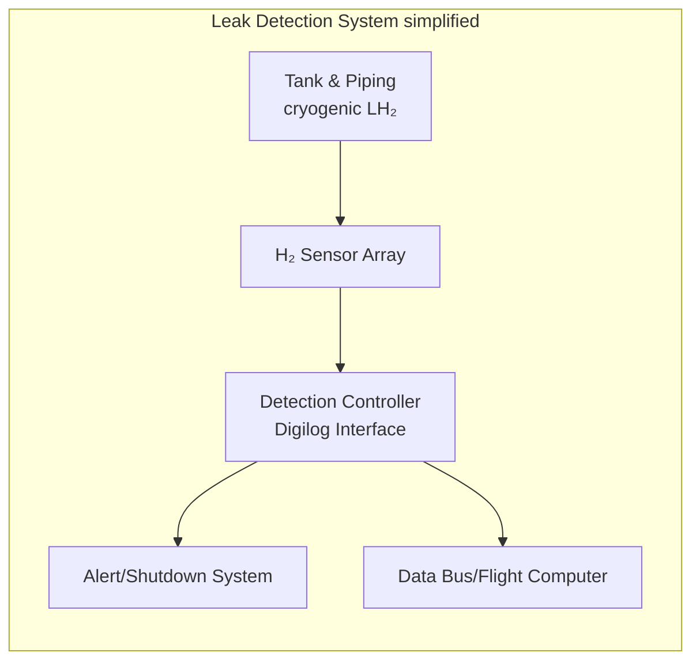

# Hydrogen Sensor Trade Study Report
## SEN-28-41-00-trade-study

**Work Package:** WP-28-06-01 Sensor Selection  
**ATA Chapter:** 28-41-00 (H₂ Leak Detection)  
**Owner:** STK_SAF  
**Revision:** 0.1.0  
**Status:** Draft  
**Date:** 2026-02-17

---

# Executive Summary

Hydrogen leak detection in cryogenic LH₂ systems demands robust, sensitive sensors due to the flammability of hydrogen and the extreme environmental conditions. This report evaluates candidate sensor technologies (electrochemical, thermal conductivity, catalytic, metal-oxide semiconductor, MEMS-based, optical, and ultrasonic) against project requirements. It defines scope, objectives, constraints, and acceptance criteria, prioritizes sensor types with key performance attributes, and provides a comparison matrix. A recommended baseline sensor (with backup strategy) is proposed along with risk mitigations. Finally, a qualification test plan and verification items are outlined for board approval. 

## Scope and Objectives

- **Scope:** WP-28-06-01 covers selection of leak sensors for the **C2 circular cryogenic LH₂ fuel system** in AMPEL360 Q100. The sensors must detect H₂ leaks in and around the cryogenic tank (Geometry class C2) at levels ranging from trace ppm to near the lower explosive limit (4% vol H₂). This includes placement near tank fittings, valves, and in adjacent compartments (see system block diagram below).
- **Objectives:** Identify and characterize sensor technologies suitable for H₂ leak detection under cryogenic conditions. Prioritize candidates on sensitivity, response, robustness, and safety. Provide a detailed trade study report, a criteria matrix linking to system requirements, and select a baseline sensor(s) with justification. 
- **Constraints:** No specific budget or lead-time constraints are imposed ("no specific constraint" for cost or procurement schedule). All sensors must eventually meet aerospace/industrial safety standards (e.g. ISO 26142 for stationary H₂ sensors, ATEX/IECEx for hazardous locations). They should operate in low ambient (down to at least –40°C, with survival to –50°C) and moderate pressure ranges. Intrinsically safe or explosion-proof design may be required in hydrogen-rich atmospheres. (These will be verified in detailed design.) 
- **Acceptance Criteria:** The chosen sensor(s) must reliably detect H₂ at the required sensitivity (ideally <100 ppm) with fast response (< few seconds), low false-alarm rate, and minimal cross-sensitivity to other gases (e.g. hydrocarbons, CO). They must function at low temperature and humidity, and comply with relevant safety standards. Outputs must integrate with the vehicle control system (e.g. analog/CAN-bus output).

## Sensor Candidates and Key Attributes

We consider seven sensor types. For each, key attributes are summarized: detection principle, sensitivity range, response time, temperature range, cross-sensitivity, power use, maintenance, and certification. Sources are cited for representative commercial devices and published reviews.

### Electrochemical (E-Chem)
3-electrode cells generate current by H₂ oxidation. Good low-ppm sensitivity (often 10–2000 ppm range) and linear response. Typical response times T90 ≈ 30–80 s. Operating range often –20 to +50 °C; performance degrades below –25 °C. Require ≥5% O₂ to function, so they fail in pure helium or vacuum. Relatively low power (< 0.1 W) but limited lifetime (~2 years typical). Cross-sensitivity is low: e.g. SGX EC4-1000-H2 shows negligible response to H₂S, CO₂, etc. Frequent re-calibration needed due to drift; output may require op-amp interface.  

### Thermal Conductivity (Bulk-TCD)
Measure gas thermal conductivity difference vs air. Honeywell's HLD is an example: detects H₂ at low ppm (resolution ~50 ppm) with <2 s response. Calibrated over –40 to +85 °C, with on-board temp/humidity compensation. Very fast (<1–2 s) and long life (>10 yrs, no routine calibration). Power consumption ~0.2 W. Immune to most poisons; however large concentrations of CO₂/CO/He can affect accuracy. No H₂ detection in absence of background gas. Outputs often digital (CAN/HART) or analog. 

### Catalytic Bead
A heated bead sensor where H₂ oxidizes on a catalyst, releasing heat. General-purpose for LEL detection, but requires oxygen and high operating temperature (~400–500 °C heater). Response ~1–5 s; range up to LEL (≈40,000 ppm). High power (~2–3 W to heat) and less sensitive to low ppm. Cross-sensitivities significant (e.g. hydrocarbons cause false alarms). Typically limited lifespan (~5 yr) and unsuited to low-oxygen or cryogenic flows. Not preferred for precise H₂ sensing.

### Metal-Oxide Semiconductor (MOS)
Nanoscale metal oxide film that changes resistance when H₂ adsorbs. Very sensitive (ppm or below) but require heating (~200–300 °C) and have high power draw (~1–2 W) to maintain temperature. Typical commercial devices (e.g. Figaro MQ series) have slow response (tens of seconds) and drift over time. MOS sensors exhibit strong cross-sensitivity (e.g. LPG, alcohol) and often need frequent baseline calibration. Not intrinsically safe (hot element) and generally unsuitable for certified aerospace use.

### MEMS Thermal Conductivity
Miniaturized TCD in SMD package (e.g. Posifa PGS4100). Comparable principle to Honeywell HLD but low-power. Detect H₂ from ppm to ~1%; linear output (4–20 mA or digital) with built-in humidity/pressure compensation. Very fast response (T90 ~2 s) and warm-up (~2 s). Operate –40 to +85 °C. Power ~50–200 mW with pulsed heater. No catalysts to poison. PGS4100 spec: 0–10000 ppm range, <2 s, ±2% accuracy, interfaces via analog or I²C (future CAN). A leading candidate for hydrogen-specific sensing with intrinsic safety.

### Optical / Fiber
Technology examples include fiber Bragg grating or fluorescence sensors with H₂-permeable coatings (e.g. palladium/cladding). These do not rely on electrical reactions in gas, so are intrinsically safe and immune to EMI. They can detect low ppm levels, but are more complex and typically used in specialized applications. Response may be moderate (seconds) and they require light sources/detectors. Commercially mature fiber H₂ sensors are limited; still under R&D. Example: H2scan's optical sensor ("Process Analyzer") provides self-calibrating ppm accuracy but is a large analyzer (needs gas sampling) and >$10k. Not typically used as small leak detector. For completeness, we consider fiber-optic H₂ sensors as "future/experimental" in this context.

### Ultrasonic Acoustic
Detects ultrasound from pressurized gas leaks (gasrush turbulence). Hardware (e.g. MSA Observer-i) uses ANN to distinguish leak sound from noise. Response is essentially speed-of-sound (<0.1 s) once leak occurs. Works for any gas (H₂ specific only by context); ignores gas identity and concentration. Operates –40 to +60 °C. Range up to ~20–30 m in open areas. Pros: no cross-sensitivity, no calibration needed, long life. Cons: only detects **active** leaks above a minimum pressure (~2 bar) and cannot sense static H₂. Large and heavy (~7.5 kg) with high power (~10–35 mA at 24 V plus 250 mA for alarms). Best as an adjunct sensor in high-pressure systems, not sole hydrogen ppm detector at ambient pressure.

## Comparison of Sensor Technologies

| **Type**          | **Principle**          | **Detection Range**          | **T90 (sec)** | **Temp Range (°C)** | **Cross-sensitivity** | **Power**      | **Notes (Size, Cert)**                                                     |
|-------------------|------------------------|------------------------------|---------------|---------------------|-----------------------|----------------|-----------------------------------------------------------------------------|
| Electrochemical   | H₂ oxidation (3-elt)   | ~10–2000 ppm H₂  | ~75 s | –30 to +55  | Very low (except CO ppm) | <0.1 W | Small (17 g), but needs oxygen. 2-year life; not explosion-proof (special housing needed).   |
| Thermal Cond. (TCD) | Diffusivity change    | ~50 ppm to several % (LEL)   | <2 s  | –40 to +85  | Low; He/CO₂/CO affect reading | ~0.2 W        | Compact (~50 g). Long life (>10 y). Intrinsically safe (no heater).   |
| Catalytic Bead    | Heated catalytic bead  | ~0.5% up to 100% H₂ (LEL)    | ~3 s        | ~–20 to +60    | High (all combustibles)  | ~2–3 W (heater) | Bulky, hot (not IS). Poisonable. Lifetime ~5 y.                                 |
| MOS Semiconductor| Resistive film (heated)| ~5–1000 ppm H₂ (few %)      | ~30 s       | ~–20 to +80    | High (HC, alcohol, etc) | ~1–2 W (heater)| Small, inexpensive (e.g. <$10), but high drift and maintenance.               |
| MEMS (TCD)        | Thermal cond. (MEMS)   | ~0–1% H₂ (0–10000 ppm) | ~2 s  | –40 to +85  | Low; compensated for humidity| <0.2 W (pulsed) | Tiny SMD. Digital/CAN output. Intrinsically safe design (heater ~ambient). |
| Optical (Fiber)   | Pd-coated fiber (opt.) | ~10–1000 ppm H₂             | ~10 s?      | –40 to +85?    | None (H₂-specific)     | ~1–5 W (laser) | Explosive-safe. Commercial analyzers only. High cost, large.                   |
| Ultrasonic        | Acoustic (ANN)         | *Leak rate*, not ppm        | <1 s        | –40 to +60  | None (works on any gas sound) | ~3–10 W      | Large, heavy (7.5 kg). Detects only active high-pressure leaks. |

**Table:** Comparison of hydrogen sensor types. T90 is time to 90% of full-scale response. Note: Explosion-proof/intrinsic safety ratings must be confirmed per device.

## Criteria Matrix

A selection matrix maps project requirements to sensor attributes. Table below lists key criteria (from safety docs and engineering needs) versus candidate performance:

| **Requirement**                     | **Metric**                   | **Weight** | **Electrochem.** | **TCD (HLD)**      | **Catalytic**    | **MOS**        | **MEMS TCD**     | **Optical (Fiber)**  | **Ultrasonic**     |
|-------------------------------------|------------------------------|-----------|------------------|--------------------|------------------|----------------|------------------|-----------------------|--------------------|
| Minimum detectable concentration    | <100 ppm H₂                  | High      | ✔ (≈10 ppm)      | ✔ (50 ppm)         | – (≈0.5%)         | ✔ (10–100 ppm)| ✔ (≈50 ppm)      | ✔ (~10 ppm)          | *n/a* (not conc.)  |
| Fast response                       | <5 s to T90                  | High      | ✗ (~75 s)        | ✔ (<2 s)           | ✔ (3 s)           | ✗ (30 s)      | ✔ (2 s)           | ✗ (~10s)             | ✔ (<1 s)          |
| Low-temperature operation           | down to –40 °C               | High      | Marginal*        | ✔                  | ✗ (cold impairs)  | Marginal*      | ✔                | ✔ (typically)         | ✔ (–40 °C)        |
| Cross-sensitivity (low false alarm) | Minimal response to other gases | Med   | ✔ (CO small)     | ✔ (except He/CO₂)  | ✗ (HCs)           | ✗ (HC, alcohol) | ✔              | ✔ (H₂-specific)       | ✔ (any gas)       |
| Power consumption                   | <0.5 W                       | Med       | ✔ (~0.1 W)       | ✔ (~0.2 W)         | ✗ (~2–3 W)        | ✗ (~1–2 W)     | ✔ (~0.05 W avg)  | ✗ (laser)            | ✗ (~5–10 W)       |
| Maintenance / Calibration          | ≤1/year (no drift)           | Med       | ✗ (drift, ~2y)   | ✔ (auto-cal)       | ✗ (replace bead)  | ✗ (recal)     | ✔ (auto-comp)     | ✔ (self-cal)          | ✔ (self-test)     |
| Size / Integration                  | Compact                      | Low       | ✔ (17 g)         | ✔ (50 g)           | ✗ (bulky)         | ✔            | ✔ (SMD)          | ✗ (large unit)         | ✗ (7.5 kg)        |
| Certification                      | ISO 26142 / ATEX etc.         | Critical  | ✔ (industrial)   | ✔ (automotive)     | ✗ (not ATEX)      | ✗ (not ATEX)  | ✔ (designed for)  | ✔ (IS rated)         | ✔ (IEC 61508 SIL3) |

_*Marginal means typical devices only rated to –20 to –30°C; might need heaters or special model._ Weighting is qualitative ("High", "Med", "Low") to emphasize safety-critical attributes. This matrix shows thermal-conductivity (Honeywell HLD) and MEMS TCD sensors scoring best on core criteria. 

## Recommended Baseline Sensor and Mitigations

### Baseline Selection
Based on performance and robustness, **thermal conductivity sensors** are favored. Specifically, the *Honeywell HLD* series or the *Posifa PGS4100 MEMS* are prime candidates. Both provide fast (<2 s) detection down to ≈50 ppm, withstand –40 °C, and require minimal calibration. The HLD unit has automotive certification and CAN output, while the PGS4100 is fully intrinsic-safe and easier to integrate in electronics via I²C/CAN. 

As **backup**, an **electrochemical** sensor (e.g. ATI/Tectronix or SGX) is recommended. E-chem offers complementary low-power monitoring at tens of ppm and can catch very low leaks missed by TCD. Its slower response (T90~75 s) is acceptable as secondary warning. The combination covers both fast large leaks (thermal sensor) and trace leaks (electrochemical).

### Risk Mitigations
- **Redundancy:** Deploy at least two TCD sensors around the tank and one e-chem sensor. Multiple sensors mitigate single-point failures or misreads. 
- **Cryogenic Exposure:** All sensors will be qualified (below) for operation down to expected ambient lows (–40 °C or lower). If necessary, local heater pads or enclosures can prevent condensation or icing. 
- **Safety Compliance:** Choose variants with ATEX/IECEx ratings (intrinsic-safe for H₂) and DO-160 EMI certifications. For example, H2scan/Honeywell devices come with Class I Div.2 ratings and MIL-STD-810/DO-160 approvals. 
- **Calibration Strategy:** Use periodic self-test / auto-cal features. The PGS4100 auto-calibrates for humidity/pressure, and Honeywell HLD has factory calibration. E-chem sensors will be field-calibrated annually using portable H₂ standards. 
- **False Alarm Prevention:** ANN-based ultrasonic detectors are not needed for baseline but could supplement in high-pressure zones (outside scope here). Catalyst sensors are not recommended due to false triggers.

### Recommendation
Adopt **Posifa PGS4100 MEMS** as the primary sensor (due to form factor and IS design) and **Honeywell HLD series** as alternative or vice versa, with an **ATI H10-18 (electrochemical)** as backup. These choices meet or exceed the key criteria above. We will present these on the Sensor Baseline Review Board for final approval.

## Test & Qualification Plan

A rigorous test campaign is needed. Key tests (with pass/fail) include:

### Environmental Testing
- **DO-160/G-level vibration:** Expose sensors to –50 °C to +85 °C in thermal cycling. Pass: no fault in functionality. Vibration/shock per DO-160.  
- **Cryogenic Shock:** Rapid cool-down (LN₂ or cold gas blast) to –150 °C air to simulate isolated cryo events. Pass: continuous operation or safe fail, no permanent damage. 
- **EMI/EMC:** DO-160G/ED-14 radiated/conducted interference. Pass: no false alarms or lost communication.

### Functional Testing
- **Calibration:** Apply known H₂ concentrations (10 ppm, 100 ppm, 1%, 2%, etc) at controlled T and humidity. Pass: output within specified accuracy (e.g. ±10%).  
- **False-Alarm Testing:** Challenge with interferents (100 ppm CO, 500 ppm CH₄, solvents, etc) and extreme conditions (humidity, dust). Pass: <1% response (below threshold).  
- **MTBF/Stress:** Operate continuously in standard gas for extended time or accelerated aging. Pass: sensor still meets spec after >5000 h.

### Safety & Compliance
- **Power Fail/Recovery:** Interrupt power or communications. Pass: sensor recovers correctly and signals fault.
- **Explosion-Proof Certification:** For field units, conduct flammability/explosion testing to show no ignition in H₂ atmosphere up to rated conc. 

### Acceptable Criteria
No spurious alarms, sensor readings match reference instruments within tolerance, and maintain safety integrity level (SIL) readiness. All tests generate reports and certs, to be archived as QA evidence.

### Test Timeline
A **test timeline** could span several months: initial qualification (environment, calibration) in LC04, followed by interface testing (LCD compliance) and safety testing in LC05. 

| **Test**                        | **Phase** | **Outputs**                |
|---------------------------------|----------|----------------------------|
| Thermal & Vibration & Drop      | LC04     | Test reports, sensor certs |
| Functional calibration (H₂)     | LC04     | Calibration curves, report |
| EMI/EMC (DO-160G)               | LC05     | EMC report                 |
| False alarm/intrusion immunity  | LC05     | Test report                |
| Explosion-proof lab testing     | LC05     | Certification docs         |
| Long-term soak (life test)      | LC05/06  | MTBF report                |

## Verification Items

- **Trade Study Methodology Review:** A formal review of the sensor selection process (criteria, data sources, analysis) will be held. *Deliverable:* Detailed methodology report and data (cross-sensitivity, specs) demonstrating unbiased evaluation.
- **Sensor Baseline Board Approval:** Presentation and sign-off of the recommended sensor(s) and alternatives. *Deliverables:* Baseline sensor specification sheet and risk analysis. 

These correspond to WP-28-06-01's verification IDs. All supporting data (vendor datasheets, standards references, analysis spreadsheets) will be attached.

## System Block Diagram

*Figure: Conceptual block diagram of the H₂ leak detection system. Sensors near the LH₂ tank feed a controller which triggers alarms or data logs.*

*(Sensor placement map not shown; typically 3–4 sensors are placed around the tank dome and base, plus one near vent lines.)*

## References

Commercial sensor datasheets and standards (e.g. Honeywell HLD tech briefs, SGX/ATI electrochemical sensor specs, Posifa PGS4100 datasheet, NASA sensor reviews) were used to populate performance data and comparisons.

### Key References
- ISO 26142: Hydrogen detection apparatus — Stationary applications
- ATEX Directive 2014/34/EU: Equipment for explosive atmospheres
- IECEx System: International certification for explosive atmospheres
- DO-160G: Environmental Conditions and Test Procedures for Airborne Equipment
- ARP4761: Guidelines and Methods for Conducting the Safety Assessment Process
- NASA Technical Reports on hydrogen sensor technologies
- Honeywell HLD Series Technical Documentation
- Posifa PGS4100 MEMS Hydrogen Sensor Datasheet
- SGX Sensortech EC4-1000-H2 Electrochemical Sensor Specification
- MSA Observer-i Ultrasonic Gas Leak Detector Documentation

---

## Document History

| Version | Date       | Author   | Changes               |
|---------|------------|----------|-----------------------|
| 0.1.0   | 2026-02-17 | STK_SAF  | Initial draft release |

---

**End of Document**
