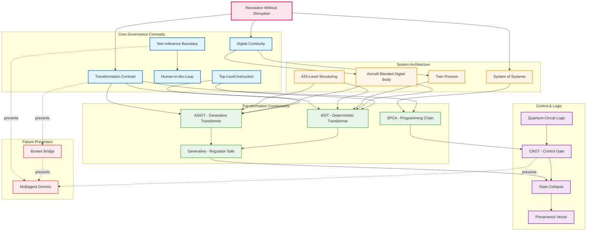
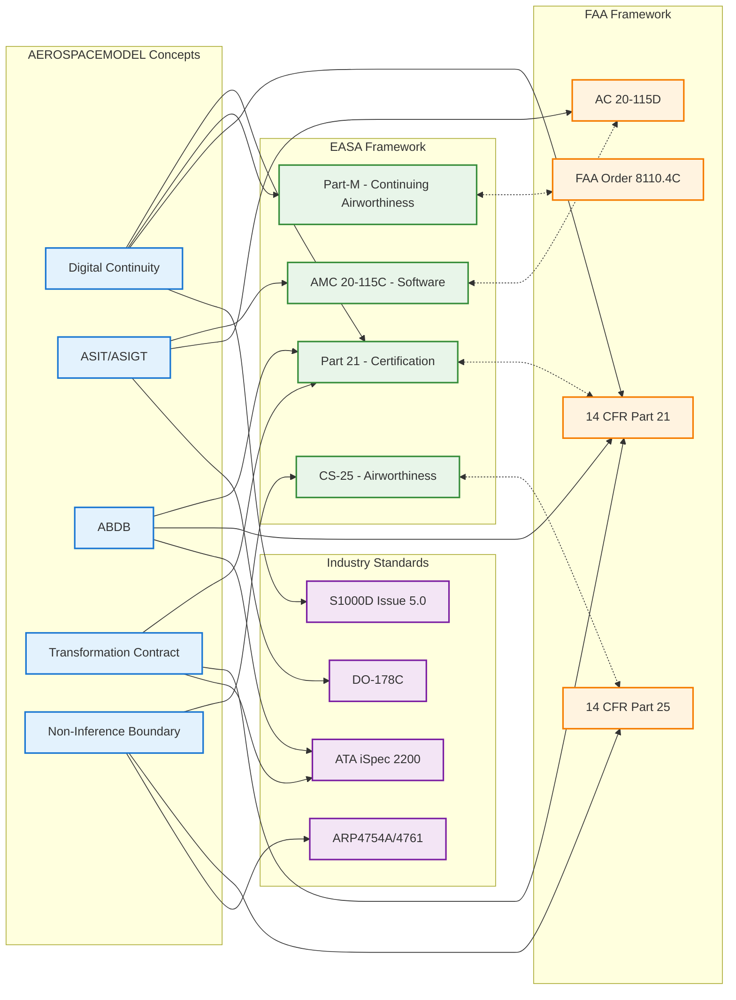
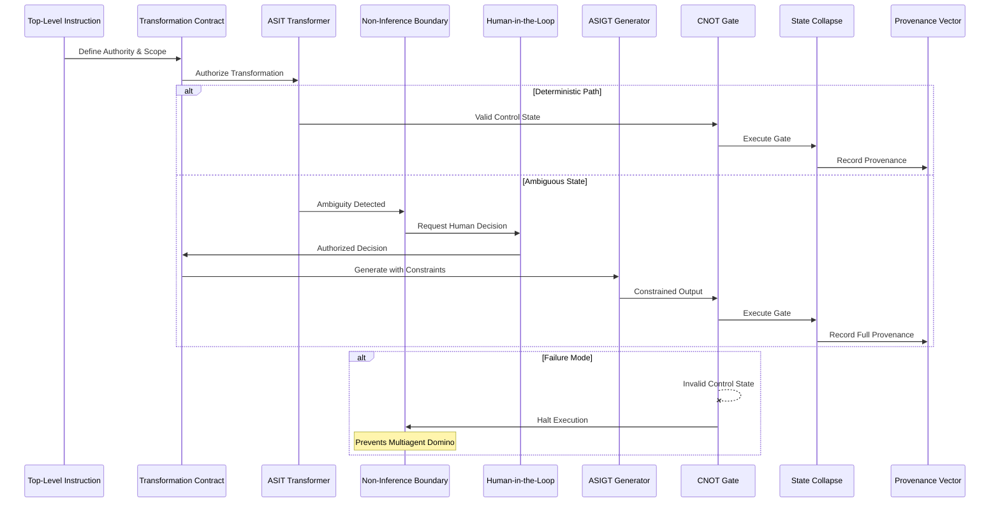
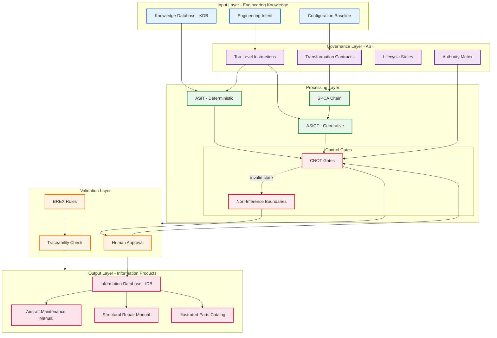
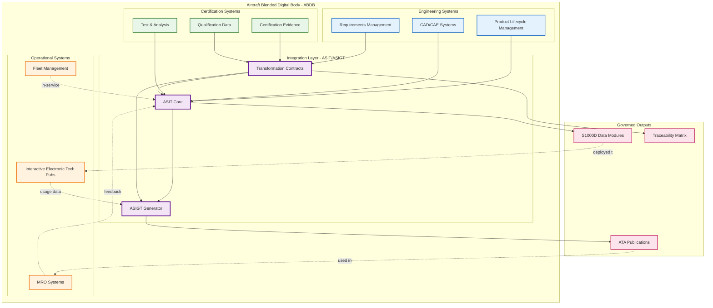
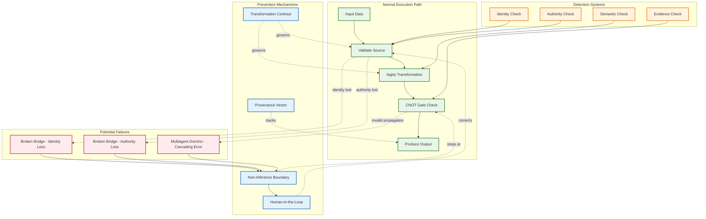
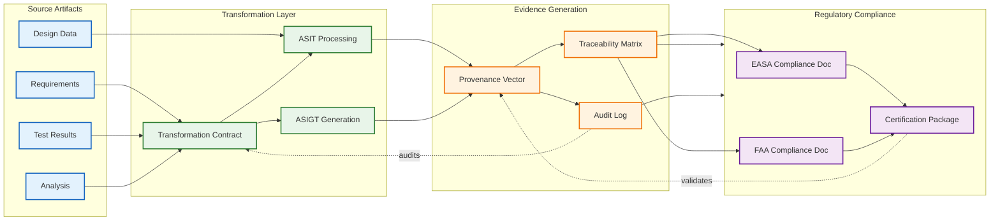
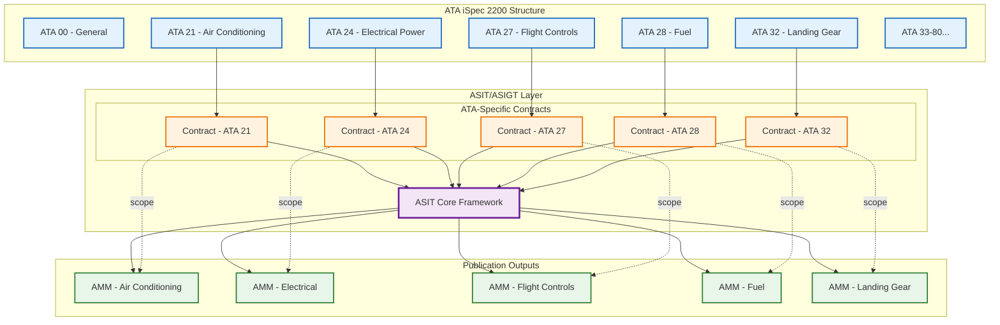
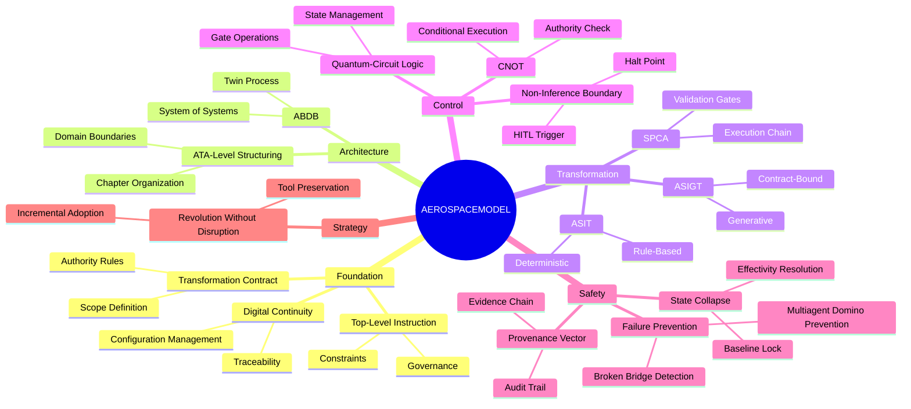
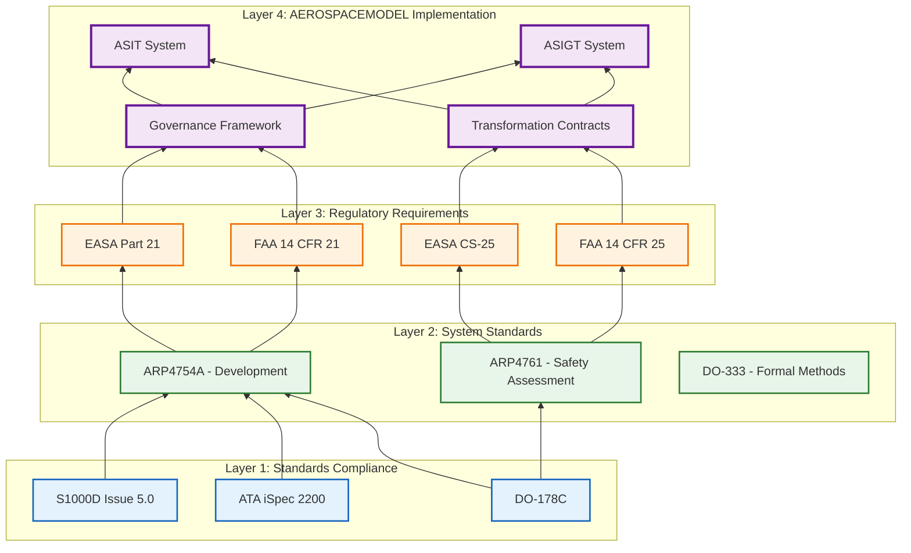

# AEROSPACEMODEL Ontology Diagram

## Overview

This document provides visual representations of the AEROSPACEMODEL ontology and its relationships to EASA/FAA regulatory concepts.

---

## 1. Complete System Ontology

---

## 2. Regulatory Mapping Overview

---

## 3. Lifecycle and Control Flow

---

## 4. Data Flow Architecture

---

## 5. System of Systems Architecture

---

## 6. Failure Prevention Model

---

## 7. Certification Evidence Chain

---

## 8. ATA Chapter Structure Integration

---

## 9. Term Hierarchy and Relationships

---

## 10. Regulatory Compliance Layers

---

## Diagram Legend

### Node Colors and Meanings

| Color | Meaning | Example Concepts |
|-------|---------|------------------|
| 🔵 Light Blue | Core Concepts & Foundation | Digital Continuity, TLI, Governance |
| 🟡 Light Orange | Architecture & System Structure | ABDB, SoS, ATA Structure |
| 🟢 Light Green | Transformation & Processing | ASIT, ASIGT, SPCA |
| 🟣 Light Purple | Control & Logic | CNOT, Quantum Logic, Contracts |
| 🔴 Light Red | Failure Modes & Prevention | Broken Bridge, Multiagent Domino |
| 🔴 Pink | Strategy & Approach | Revolution Without Disruption |

### Arrow Types

| Arrow | Meaning |
|-------|---------|
| `-->` | Direct relationship / flow |
| `-.->` | Prevention / constraint / feedback |
| `<-->` | Bidirectional relationship |
| `-.-` | Optional / conditional |

### Diagram Types

1. **Graph/Flowchart** - Shows static relationships and hierarchy
2. **Sequence Diagram** - Shows temporal flow and interactions
3. **Mindmap** - Shows conceptual organization
4. **Flowchart** - Shows process flow and decision points

---

## How to Use These Diagrams

### For Engineers
- Use **Diagram 1 (Complete System Ontology)** to understand overall concept relationships
- Use **Diagram 4 (Data Flow Architecture)** to understand implementation details
- Use **Diagram 5 (System of Systems)** to understand tool integration

### For Certification Specialists
- Use **Diagram 2 (Regulatory Mapping)** to understand regulatory alignment
- Use **Diagram 7 (Certification Evidence Chain)** to understand compliance traceability
- Use **Diagram 10 (Regulatory Compliance Layers)** to understand standards hierarchy

### For Program Managers
- Use **Diagram 3 (Lifecycle and Control Flow)** to understand governance flow
- Use **Diagram 6 (Failure Prevention Model)** to understand risk mitigation
- Use **Diagram 9 (Term Hierarchy)** for executive overview

### For Technical Writers
- Use **Diagram 8 (ATA Chapter Structure)** to understand publication organization
- Use **Diagram 4 (Data Flow)** to understand content generation flow

---

## Rendering These Diagrams

These diagrams use [Mermaid](https://mermaid.js.org/) syntax, which can be rendered in:

1. **GitHub** - Native support in Markdown files
2. **GitLab** - Native support in Markdown files
3. **VS Code** - With Mermaid extension
4. **Confluence** - With Mermaid plugin
5. **Documentation Systems** - mkdocs-material, Docusaurus, etc.
6. **Online Editors** - https://mermaid.live/

---

## Document Control

| Item | Value |
|------|-------|
| **Version** | 1.0 |
| **Date** | 2026-02-02 |
| **Status** | Active |
| **Owner** | AEROSPACEMODEL Documentation Team |
| **Related Docs** | EASA_FAA_VOCABULARY_MAPPING.md |

---

*These diagrams are maintained as living documentation and updated as the system evolves.*
